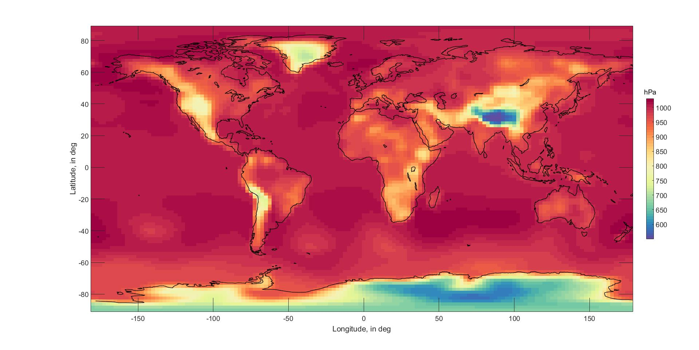
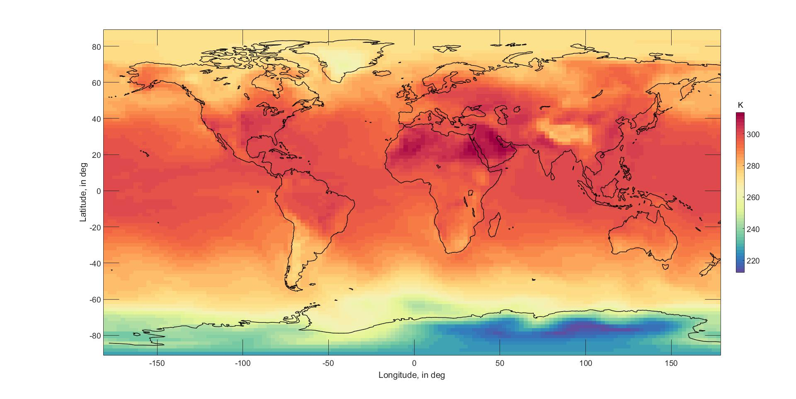
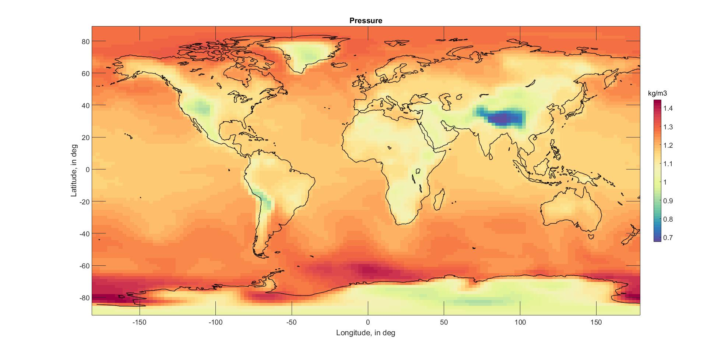

# computational-methods
Computational Methods in Meteorology with MATLAB

**Figure 1:** Calculated global pressure at sea level

**Figure 2:** Calculated global temperature at sea level

**Figure 3:** Calculated global density at sea level

**Figure 4:** Calculated CO2 over time

**Figure 4:** Calculated CO2 change over time

**Figure 4:** Calculated global temperature anomalies over time
